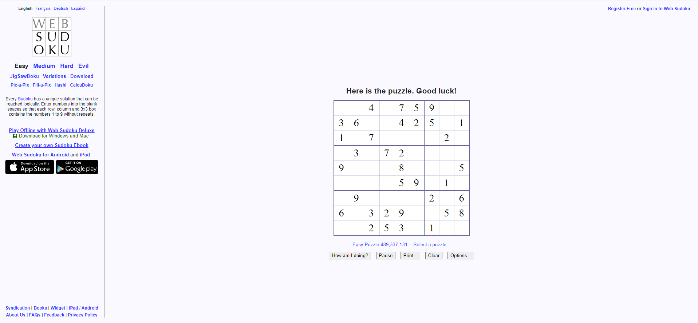
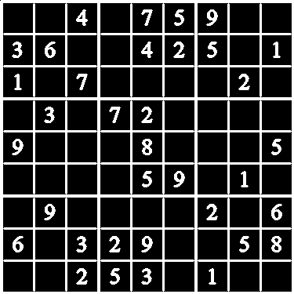

# CNN-Backtracking-Sudoku-Solver

  

 

<h2>
  CNN-based digit detector followed by a backtracking algorithm.
</h2>

 
Taking a screenshot of a sudoku board, the CV2 provides us with various methods for extracting the sudoku grid from the image.
 

  

Image modification such as convering the RGB image to Grayscale are applied to make contours and digits more distinct allowing for easier detection and classification.
 

  

 

A small CNN with ~800k parameters is trained on the MNIST digit classification dataset for use in identifying the digits in each subgrid seen above.
The sudoku grid is split into 81 such subgrids which are then iterated over, resized to 28x28, to match the network configuration, and propagated through the network to identify the digit within each subgrid. At each step the sum of all pixel values within each cropped image is taken to identify empty subgrid which are labelled as 0 to be filled in by the backtracking algorithm next.

 

  
  
  
  
  
  
  
  
  

 

Finally, with the scanned sudoku grid this is then fed into the backtracking algorithm, widely used in constraint satisfaction problems such as this one where there exist numerous conditions on the validity of a number within each subgrid. The algorithm proceeds to iterate over each possible candidate where in the case of exhausting all possible candidates it moves backwards and modifies the previous candidates.

[[2 8 4 1 7 5 9 6 3]
   
 [3 6 9 8 4 2 5 7 1]
   
 [1 5 7 9 6 3 8 2 4]
   
 [5 3 1 7 2 4 6 8 9]
   
 [9 2 6 3 8 1 7 4 5]
   
 [4 7 8 6 5 9 3 1 2]
   
 [7 9 5 4 1 8 2 3 6]
   
 [6 1 3 2 9 7 4 5 8]
   
 [8 4 2 5 3 6 1 9 7]]
 

